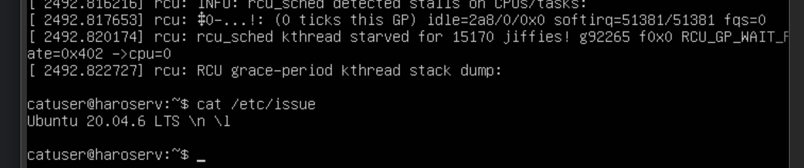

#### D01 LINUX Операционные системы UNIX/Linux (Базовый)
Отчет о проделанной работе по заданию Linux D01

## Part 1. Установка Ubuntu

##### Установить **Ubuntu 20.04 Server LTS** без графического интерфейса. (Используем программу для виртуализации - VirtualBox)

- Графический интерфейс должен отсутствовать.

- Узнайте версию Ubuntu, выполнив команду \
`cat /etc/issue.`
- Вставьте скриншот с выводом команды.

## Part 2. Создание пользователя

##### Создать пользователя, отличного от пользователя, который создавался при установке. Пользователь должен быть добавлен в группу `adm`.

- Вставьте скриншот вызова команды для создания пользователя.
- Новый пользователь должен быть в выводе команды \
`cat /etc/passwd`
- Вставьте скриншот с выводом команды.

sudo useradd -G adm catuser

## Part 3. Настройка сети ОС

##### Задать название машины вида user-1  
##### Установить временную зону, соответствующую вашему текущему местоположению.

##### Вывести названия сетевых интерфейсов с помощью консольной команды.
- В отчёте дать объяснение наличию интерфейса lo.

lo - виртуальный интерфейс устройства который отправляет полученные данные на свой вход.

##### Используя консольную команду получить ip адрес устройства, на котором вы работаете, от DHCP сервера. 
- В отчёте дать расшифровку DHCP. 

Dynamic Host Control Protocol

##### Определить и вывести на экран внешний ip-адрес шлюза (ip) и внутренний IP-адрес шлюза, он же ip-адрес по умолчанию (gw).
Внутренний gateway

Внешний gateway

Проверить через гугл:
https://ifconfig.me

##### Задать статичные (заданные вручную, а не полученные от DHCP сервера) настройки ip, gw, dns (использовать публичный DNS серверы, например 1.1.1.1 или 8.8.8.8).
Отключаем dhcp и вносим изменения в файл конфигурации
sudo nano /etc/netplan/00-installer-config.yaml

Применяем изменения
sudo netplan apply

##### Перезагрузить виртуальную машину. Убедиться, что статичные сетевые настройки (ip, gw, dns) соответствуют заданным в предыдущем пункте.  

- В отчёте опишите, что сделали для выполнения всех семи пунктов (можно как текстом, так и скриншотами).
- Успешно пропинговать удаленные хосты 1.1.1.1 и ya.ru и вставить в отчёт скрин с выводом команды. В выводе команды должна быть фраза "0% packet loss".

## Part 4. Обновление ОС

##### Обновить системные пакеты до последней на момент выполнения задания версии.  

- После обновления системных пакетов, если ввести команду обновления повторно, должно появится сообщение, что обновления отсутствуют.
- Вставить скриншот с этим сообщением в отчёт.

sudo apt-get update
sudo apt-get dist-upgrade

## Part 5. Использование команды **sudo**

##### Разрешить пользователю, созданному в [Part 2](#part-2-создание-пользователя), выполнять команду sudo.

- В отчёте объяснить *истинное* назначение команды sudo (про то, что это слово - "волшебное", писать не стоит).  
- Поменять hostname ОС от имени пользователя, созданного в пункте [Part 2](#part-2-создание-пользователя) (используя sudo).
- Вставить скрин с изменённым hostname в отчёт.

- sudo hostname ubuntu-virt
- hostnamectl set-hostname ubuntu-virt

## Part 6. Установка и настройка службы времени

##### Настроить службу автоматической синхронизации времени.  

- Вывести время, часового пояса, в котором вы сейчас находитесь.
- Вывод следующей команды должен содержать `NTPSynchronized=yes`: \
  `timedatectl show`
- Вставить скрины с корректным временем и выводом команды в отчёт.

- timedatectl list-timezones
- sudo timedatectl set-timezone Europe/Moscow
- sudo apt install systemd-timesyncd
- timedatectl set-ntp true
- timedatectl show

## Part 7. Установка и использование текстовых редакторов 

##### Установить текстовые редакторы **VIM** (+ любые два по желанию **NANO**, **MCEDIT**, **JOE** и т.д.)  
##### Используя каждый из трех выбранных редакторов, создайте файл *test_X.txt*, где X -- название редактора, в котором создан файл. Напишите в нём свой никнейм, закройте файл с сохранением изменений.  
- В отчёт вставьте скриншоты:
  - Из каждого редактора с содержимым файла перед закрытием.
- В отчёте укажите, что сделали для выхода с сохранением изменений.

- VIM Esc - :w - :q
- NANO Cntrl+O - Cntrl+X
- MCEDIT F2 - F10

##### Используя каждый из трех выбранных редакторов, откройте файл на редактирование, отредактируйте файл, заменив никнейм на строку "21 School 21", закройте файл без сохранения изменений.
- В отчёт вставьте скриншоты:
    - Из каждого редактора с содержимым файла после редактирования.
- В отчёте укажите, что сделали для выхода без сохранения изменений.

- VIM Esc - :q!
- NANO Cntrl+X - No
- MCEDIT F10 - No

##### Используя каждый из трех выбранных редакторов, отредактируйте файл ещё раз (по аналогии с предыдущим пунктом), а затем освойте функции поиска по содержимому файла (слово) и замены слова на любое другое.
- В отчёт вставьте скриншоты:
    - Из каждого редактора с результатами поиска слова.
    - Из каждого редактора с командами, введёнными для замены слова на другое.

- VIM Поиск /pattern || Замена :s/odo/ggg
- NANO Поиск Cntrl+\ || Замена Cntrl+\ hhh - Yes
- MCEDIT Поиск F7 || F7 Shift+стрелка (выделение) F4 - fff - Yes

## Part 8. Установка и базовая настройка сервиса **SSHD**

##### Установить службу SSHd.  
##### Добавить автостарт службы при загрузке системы.  
##### Перенастроить службу SSHd на порт 2022.  
##### Используя команду ps, показать наличие процесса sshd. Для этого к команде нужно подобрать ключи.
- В отчёте объяснить значение команды и каждого ключа в ней.
##### Перезагрузить систему.
- В отчёте опишите, что сделали для выполнения всех пяти пунктов (можно как текстом, так и скриншотами).
- Вывод команды netstat -tan должен содержать  \
`tcp 0 0 0.0.0.0:2022 0.0.0.0:* LISTEN`  \
(если команды netstat нет, то ее нужно установить)
- Скрин с выводом команды вставить в отчёт.
- В отчёте объяснить значение ключей -tan, значение каждого столбца вывода, значение 0.0.0.0.

- sudo apt-get install ssh
- sudo apt install openssh-server
- sudo systemctl enable sshd (добавить в рестарт)
- systemctl status sshd
- sudo nano /etc/ssh/sshd_config (#Port 2022)
- ps aux | grep sshd
restart
R+ - процесс будет запускаться при старте

## Part 9. Установка и использование утилит **top**, **htop**

##### Установить и запустить утилиты top и htop.  

- По выводу команды top определить и написать в отчёте:
  - uptime
  - количество авторизованных пользователей
  - общую загрузку системы
  - общее количество процессов
  - загрузку cpu
  - загрузку памяти
  - pid процесса занимающего больше всего памяти
  - pid процесса, занимающего больше всего процессорного времени
- В отчёт вставить скрин с выводом команды htop:
  - отсортированному по PID, PERCENT_CPU, PERCENT_MEM, TIME
  - отфильтрованному для процесса sshd
  - с процессом syslog, найденным, используя поиск 
  - с добавленным выводом hostname, clock и uptime

### top

uptime — утилита в UNIX-подобных системах, показывающая текущее время, время работы после загрузки, количество текущих пользователей в компьютерной системе и нагрузку за последние 1, 5 и 15 минут.

Загрузка системы - load average

VIRT - Virtual Image
RES - Resident memory size
SHR - Shared Memory size

### htop

## Part 10. Использование утилиты **fdisk**

##### Запустить команду fdisk -l.

- В отчёте написать название жесткого диска, его размер и количество секторов, а также размер swap.

## Part 11. Использование утилиты **df** 

##### Запустить команду df.  
- В отчёте написать для корневого раздела (/):
  - размер раздела
  - размер занятого пространства
  - размер свободного пространства
  - процент использования
- Определить и написать в отчёт единицу измерения в выводе.

- df -h

##### Запустить команду df -Th.
- В отчёте написать для корневого раздела (/):
    - размер раздела
    - размер занятого пространства
    - размер свободного пространства
    - процент использования
- Определить и написать в отчёт тип файловой системы для раздела.

## Part 12. Использование утилиты **du**

##### Запустить команду du.
##### Вывести размер папок /home, /var, /var/log (в байтах, в человекочитаемом виде)
##### Вывести размер всего содержимого в /var/log (не общее, а каждого вложенного элемента, используя *)

- В отчёт вставить скрины с выводом всех использованных команд.

- du -sh /home

- sudo du -sh /var

- sudo du -sh /var/log

- sudo du -sh /var/log/*

## Part 13. Установка и использование утилиты **ncdu**

##### Установить утилиту ncdu.
##### Вывести размер папок /home, /var, /var/log.

- Размеры должны примерно совпадать с полученными в [Part 12](#part-12-использование-утилиты-du).

- В отчёт вставить скрины с выводом использованных команд.

- ncdu /home

- ncdu /var

- ncdu /var/log

## Part 14. Работа с системными журналами

##### Открыть для просмотра:
##### 1. /var/log/dmesg
##### 2. /var/log/syslog
##### 3. /var/log/auth.log  

- Написать в отчёте время последней успешной авторизации, имя пользователя и метод входа в систему.

- Перезапустить службу SSHd.
sudo systemctl restart sshd.service

- Вставить в отчёт скрин с сообщением о рестарте службы (искать в логах).

## Part 15. Использование планировщика заданий **CRON**

##### Используя планировщик заданий, запустите команду uptime через каждые 2 минуты.
- Найти в системных журналах строчки (минимум две в заданном временном диапазоне) о выполнении.
- Вывести на экран список текущих заданий для CRON.
- Вставить в отчёт скрины со строчками о выполнении и списком текущих задач.

sudo apt install cron
sudo systemctl enable cron
sudo systemctl status cron

Системный sudo nano /etc/crontab
Текущего пользователя /var/spool/cron/crontabs/

Редактирование crontab -e

minute hour day_of_month month day_of_week command_to_run

Просмотр crontab -l

##### Удалите все задания из планировщика заданий.
- В отчёт вставьте скрин со списком текущих заданий для CRON.

