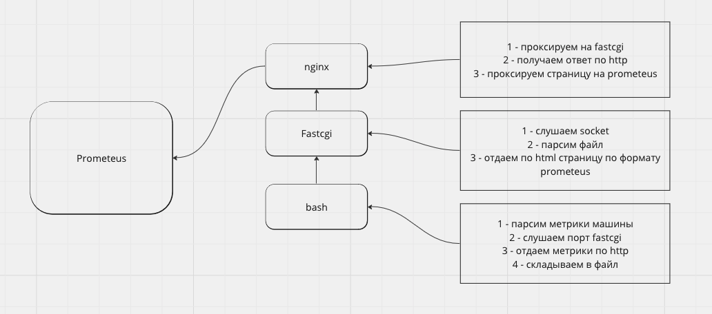

### REPORT 09

###

#include <stdio.h>
#include <stdlib.h>
#include <string.h>

#define PORT 8080

int main() {
    int sockfd, newsockfd, portno, clilen;
    struct sockaddr_in serv_addr, cli_addr;
    char buffer[256];
    int n;

    sockfd = socket(AF_INET, SOCK_STREAM, 0);
    if (sockfd < 0) {
        perror("ERROR opening socket");
        exit(1);
    }

    portno = PORT;
    serv_addr.sin_family = AF_INET;
    serv_addr.sin_addr.s_addr = INADDR_ANY;
    serv_addr.sin_port = htons(portno);

    if (bind(sockfd, (struct sockaddr  * ) &serv_addr, sizeof(serv_addr)) < 0) {
        perror("ERROR on binding");
        exit(1);
    }

    listen(sockfd,5);
    clilen = sizeof(cli_addr);

    while(1) {
        newsockfd = accept(sockfd, (struct sockaddr  * ) &cli_addr, &clilen);
        if (newsockfd < 0) {
            perror("ERROR on accept");
            exit(1);
        }

        n = read(newsockfd, buffer, 255);
        if (n < 0) {
            perror("ERROR reading from socket");
            exit(1);
        }

        // Process the request
        // ...

        // Send response
        sprintf(buffer, "up\n");
        write(newsockfd, buffer, strlen(buffer));

        // Send CPU metric
        sprintf(buffer, "cpu_usage_seconds{job=\"my-job\",instance=\"%s\"} %f\n", inet_ntoa(cli_addr.sin_addr), 0.5);
        write(newsockfd, buffer, strlen(buffer));

        // Send RAM metric
        sprintf(buffer, "memory_bytes{job=\"my-job\",instance=\"%s\"} %d\n", inet_ntoa(cli_addr.sin_addr), 1024);
        write(newsockfd, buffer, strlen(buffer));

        close(newsockfd);
    }

    return 0;
}
