# Simple Docker

Введение в докер. Разработка простого докер образа для собственного сервера.

### **Задание**

- В репозиторий, в папку src, должен быть загружен отчёт с расширением .md.
- В отчёте должны быть выделены все части задания, как заголовки 2-го уровня.
- В рамках одной части задания всё, что помещается в отчёт, должно быть оформлено в виде списка.
- Каждый скриншот в отчёте должен быть кратко подписан (что показано на скриншоте).
- Все скриншоты обрезаны так, чтобы была видна только нужная часть экрана.
- На одном скриншоте допускается отображение сразу нескольких пунктов задания, но они все должны быть описаны в подписи к скриншоту.
- В репозиторий, в папку src/server, должны быть загружены исходные файлы для запуска веб-сервера из третьего задания.
- В репозиторий, в папку src, должны быть загружены итоговые докерфайлы для запуска образов из четвёртого и пятого заданий.
- В репозиторий, в папку src, должен быть загружен *docker-compose.yml* шестого задания.
- Необходимо быть готовым продемонстрировать решение вживую при необходимости.

## Part 1. Готовый докер

В качестве конечной цели своей небольшой практики вы сразу выбрали написание докер образа для собственного веб сервера **nginx**.
``````
Установка Docker
``````
``````
1.Обновите пакеты:
sudo apt update
``````
``````
2.Установите пакеты, которые необходимы для работы пакетного менеджера apt по протоколу HTTPS:
sudo apt install apt-transport-https ca-certificates curl software-properties-common
``````
``````
3.Добавьте GPG-ключ репозитория Docker:
curl -fsSL https://download.docker.com/linux/ubuntu/gpg | sudo apt-key add -
``````
``````
4.Добавьте репозиторий Docker:
sudo add-apt-repository "deb [arch=amd64] https://download.docker.com/linux/ubuntu bionic stable"
``````
``````
5.Обновите пакеты:
sudo apt update
``````
``````
6.Переключитесь в репозиторий Docker, чтобы его установить:
apt-cache policy docker-ce

В терминале должна появиться подобная информация с версией Docker:
Как установить Docker на Ubuntu 1
``````
``````
7.Установите Docker:
sudo apt install docker-ce
``````
``````
8.Проверьте работоспособность программы:
sudo systemctl status docker

В терминале должна появиться информация о том, что Docker активен:
Как установить Docker на Ubuntu 1
Docker install Ubuntu
``````
``````
9.Чтобы использовать утилиту docker, нужно добавить ваше имя пользователя в группу Docker. Для этого введите в терминале команду:
sudo usermod -aG docker ${user}
Где user — имя пользователя.
``````
``````
10.Введите:
su - ${user}
Где user — имя пользователя.

Задайте пароль пользователя.
``````
``````
12.Проверьте доступ к образам Docker:
docker run hello-world
Если вы увидите сообщение «Hello from Docker!», то всё установлено верно.

Готово, вы установили Docker в Ubuntu. Теперь вы можете использовать утилиту docker.
``````

**== Задание ==**

##### ## Рис_1 ## Взять официальный докер образ с **nginx** и выкачать его при помощи `docker pull`
``````
sudo docker pull nginx
``````
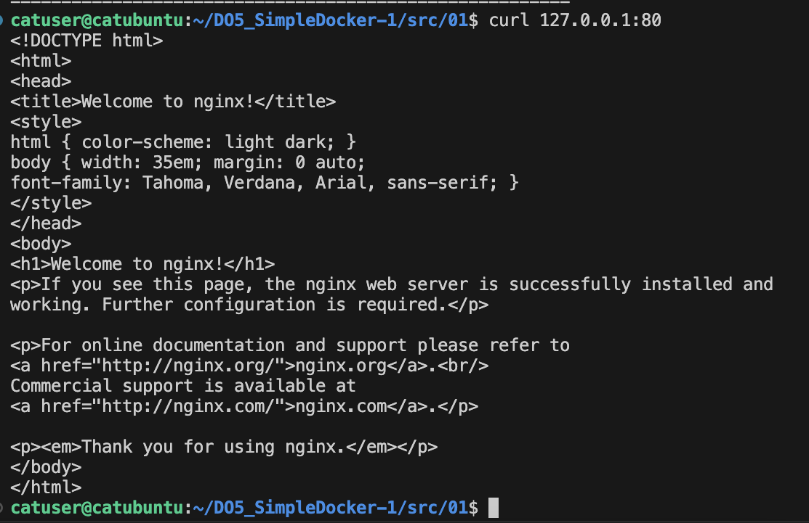

##### ## Рис_2 ## Проверить наличие докер образа через `docker images`
``````
sudo docker images
``````
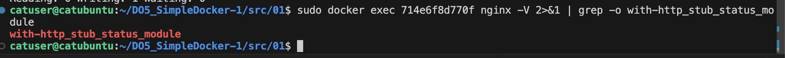

##### ## Рис_3 ## Запустить докер образ через `docker run -d [image_id|repository]`
``````
sudo docker run --name nginx-new -d c20060033e06
``````
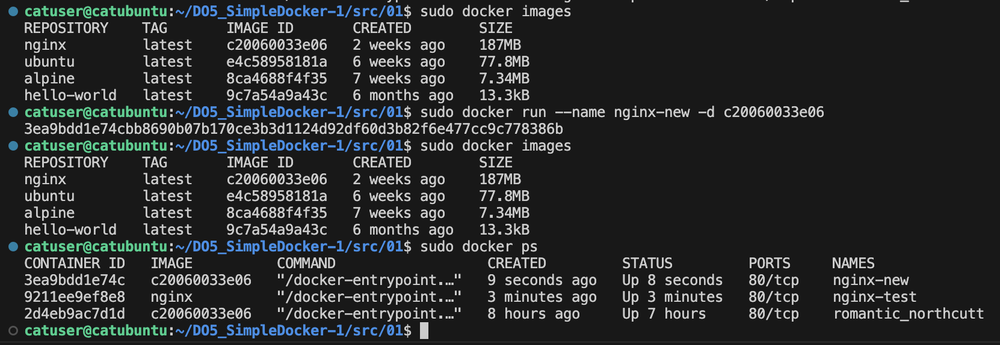

##### ## Рис_4 ## Проверить, что образ запустился через `docker ps`
``````
sudo docker ps
``````
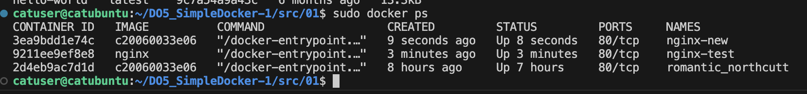

##### Посмотреть информацию о контейнере через `docker inspect [container_id|container_name]`
##### По выводу команды определить и поместить в отчёт размер контейнера, список замапленных портов и ip контейнера

##### ## Рис_5 ## ShmSize - размер контейнера
``````
sudo docker container inspect 34e3b2ec5b1a | grep Size
``````
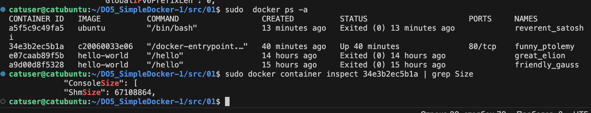

##### ## Рис_6 ## IPAddress
``````
sudo docker container inspect 714e6f8d770f | grep IP -A 3 
Также работает 
sudo docker inspect --format="{{json .NetworkSettings.Networks.bridge }}" 714e6f8d770f
``````
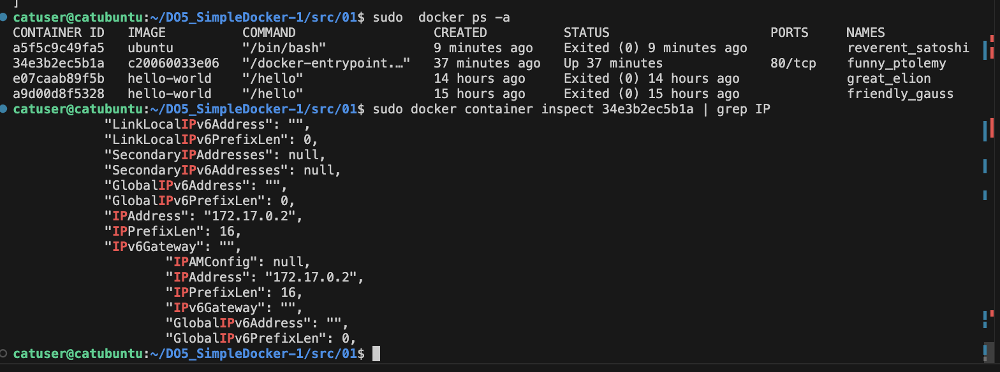

##### ## Рис_7 ## Ports - замапленные порты
``````
docker inspect --format="{{json .Config.ExposedPorts }}" 714e6f8d770f
Также работает
sudo docker inspect 714e6f8d770f | grep IP -A 5
``````
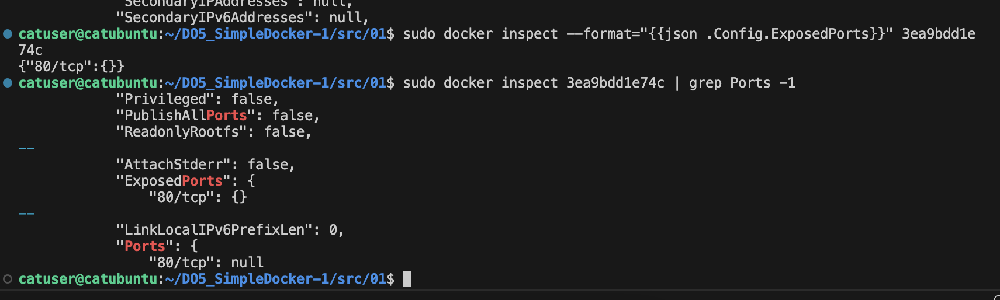

##### Остановить докер образ через `docker stop [container_id|container_name]`
``````
sudo docker stop 593aee2afb64
``````

##### ## Рис_8 ## Проверить, что образ остановился через `docker ps`
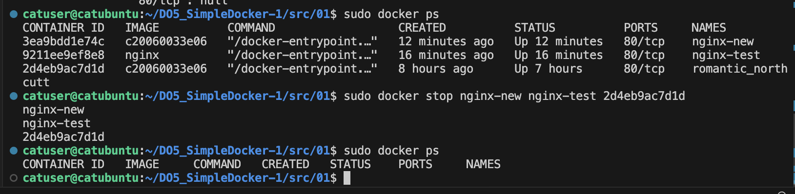

##### Запустить докер с портами 80 и 443 в контейнере, замапленными на такие же порты на локальной машине, через команду *run*
##### ## Рис_9-10 ## Проверить, что в браузере по адресу *localhost:80* доступна стартовая страница **nginx**
``````
sudo docker run -d -p 80:80 -p 443:443 593aee2afb64
``````
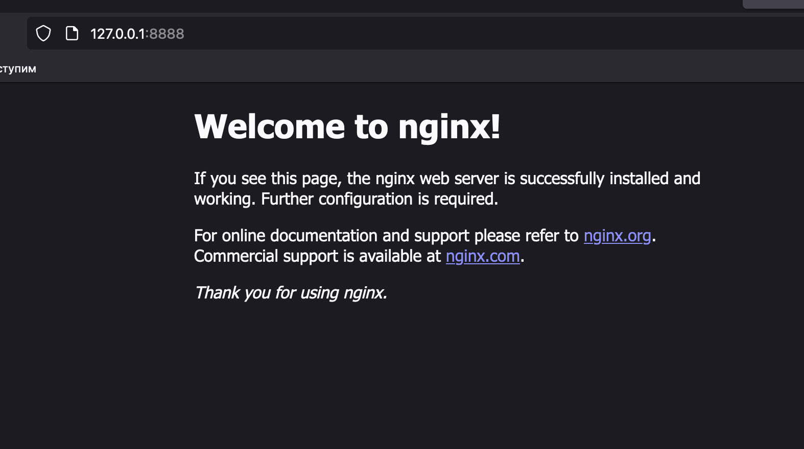


##### Перезапустить докер контейнер через `docker restart [container_id|container_name]`
##### ## Рис_11 ## Проверить любым способом, что контейнер запустился. Проверить,что произошел перезапуск по времени
``````
STATUS и CREATED - проверка рестарта
``````
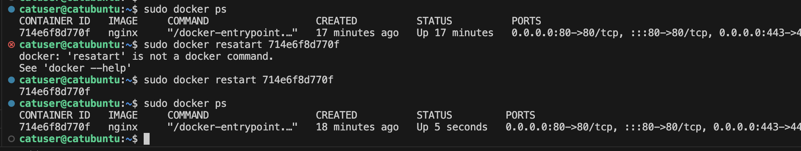


## ####################


## Part 2. Операции с контейнером

Докер образ и контейнер готовы. Теперь можно покопаться в конфигурации **nginx** и отобразить статус страницы.

**== Задание ==**

##### ## Рис_12 ## Прочитать конфигурационный файл *nginx.conf* внутри докер контейнера через команду *exec*
``````
sudo docker exec 714e6f8d770f cat /etc/nginx/nginx.conf
``````
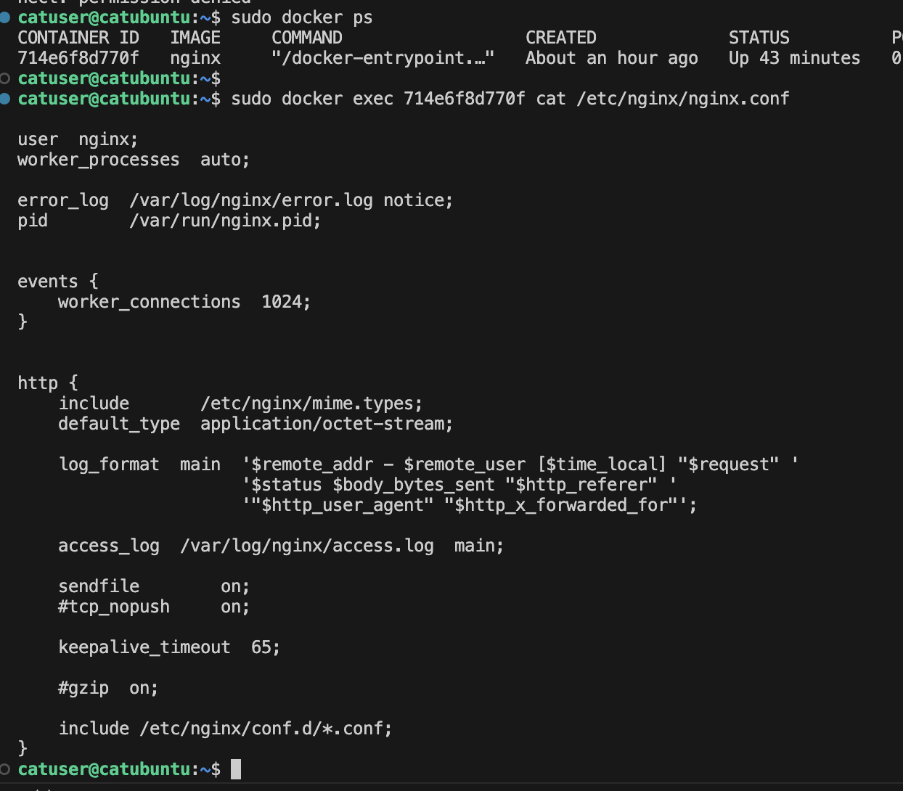

##### ## Рис_13 ## Создать на локальной машине файл *nginx.conf*

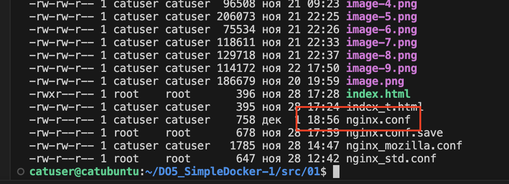

##### ## Рис_14-15 ## Настроить в нем по пути */status* отдачу страницы статуса сервера **nginx**
``````
Чтобы настроить Nginx так, чтобы он мог выводить страницу /status, вам нужно будет создать новый файл конфигурации Nginx и добавить в него следующий блок:

location /status {
   stub_status;
}

Но для начала нужно проверить, работает ли модуль with-http_stub_status_module для nginx. Для этого необходимо проверить в контейнере nginx наличие этого модуля.
``````
``````
sudo docker exec 714e6f8d770f nginx -V 2>&1 | grep -o with-http_stub_status_module
``````

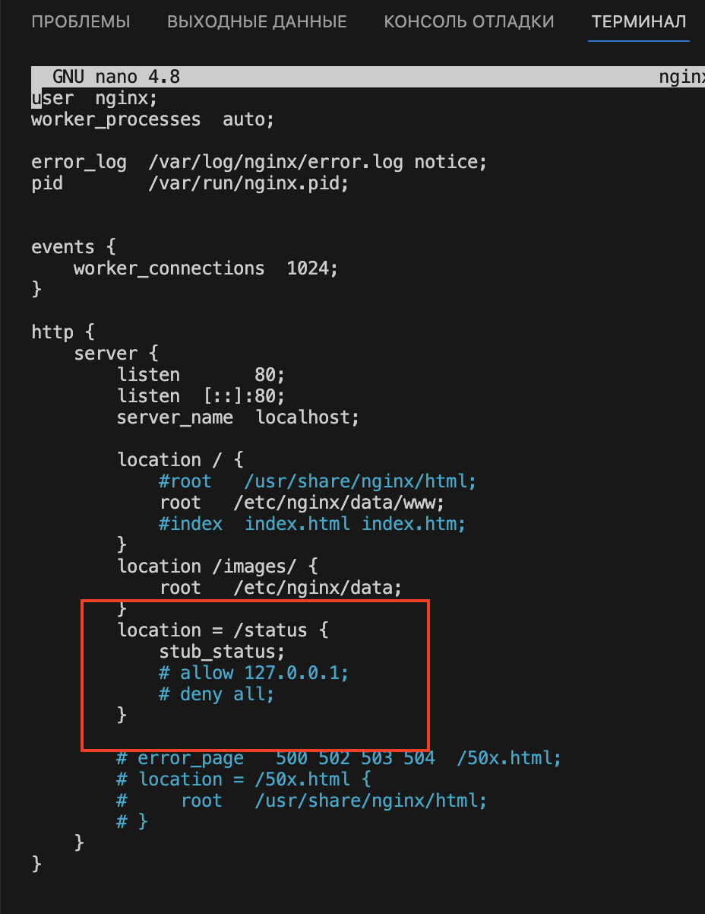

``````
Для компиляции nginx с модулем --with-http_stub_status_module:
``````
``````
wget http://nginx.org/download/nginx-1.13.12.tar.gz
tar xfz nginx-1.13.12.tar.gz
cd nginx-1.13.12/
./configure --with-http_stub_status_module
make
make install
``````

##### Скопировать созданный файл *nginx.conf* внутрь докер образа через команду `docker cp`
``````
sudo docker cp nginx.conf 714e6f8d770f:/etc/nginx/nginx.conf
``````

##### Перезапустить **nginx** внутри докер образа через команду *exec*
``````
sudo docker exec 714e6f8d770f nginx -s reload
``````

##### ## Рис_16-17 ## Проверить, что по адресу *localhost:80/status* отдается страничка со статусом сервера **nginx**
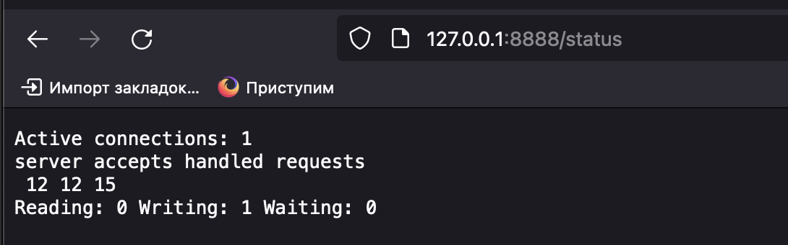
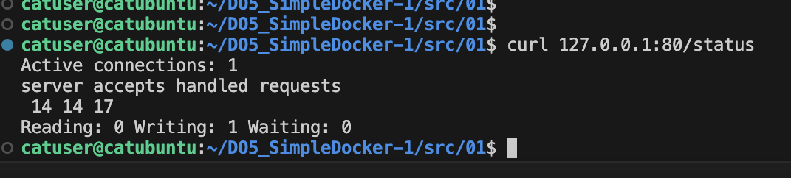

##### ## Рис_18 ## Экспортировать контейнер в файл *container.tar* через команду *export*
``````
sudo docker export 714e6f8d770f > container_export.tar
``````
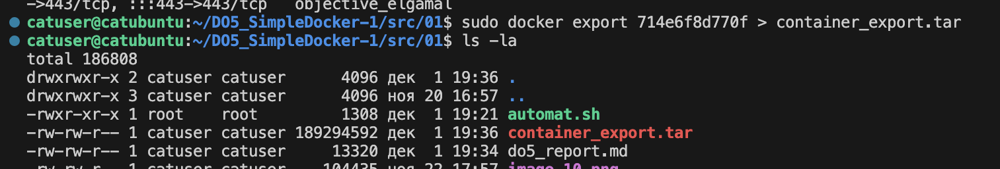

##### ## Рис_19 ## Остановить контейнер
``````
sudo docker stop 714e6f8d770f
``````
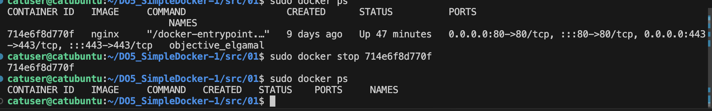
##### ## Рис_20 ## Удалить образ через `docker rmi [image_id|repository]`, не удаляя перед этим контейнеры
``````
sudo docker rmi c20060033e06 -f
``````
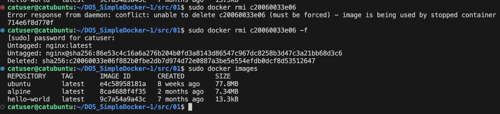

##### ## Рис_21 ## Удалить остановленный контейнер
``````
sudo docker rm 714e6f8d770f
``````
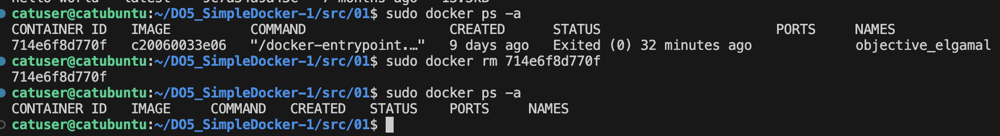

##### ## Рис_22 ## Импортировать контейнер обратно через команду *import*
``````
cat container.tar | sudo docker import nginx_imp:exported
``````
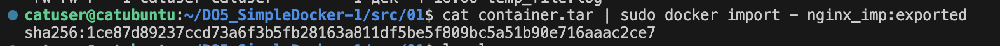

##### ## Рис_23 ## Запустить импортированный контейнер
``````
Как видно из терминала, такой подход не работает. Потому как фактически, в Docker нет команды 'export' для контейнера, только для образов. Однако, мы использовали 'export' для создания файла с данными файловой системы контейнера в формате tar, тем самым сохранив файлы системы контейнера.

Для дальнейшего будем использовать команды 'save' и 'load'
``````
###### ## Рис_24 ## Ошибка после неправильного экспорта. Переходим на использоание команд save и load
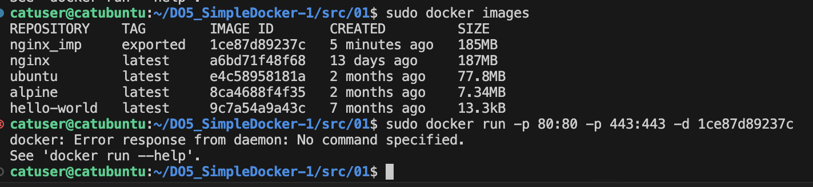

``````
sudo docker save nginx > nginx_exported.tar
``````

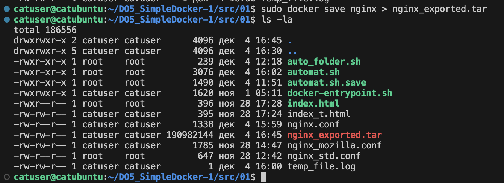

``````
sudo docker docker load -i nginx_exported.tar
``````
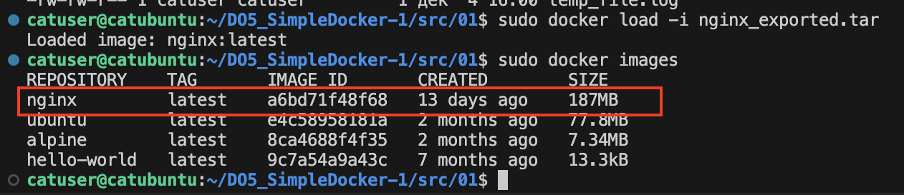
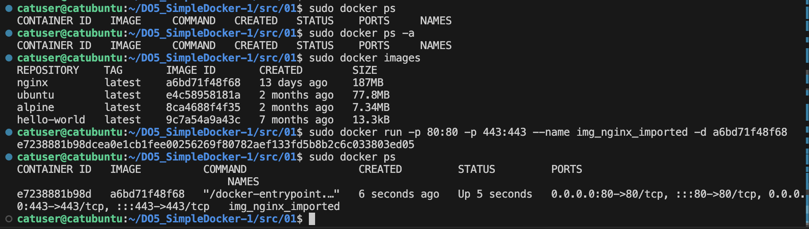

##### ###### ## Рис_25 ## Проверить, что по адресу *localhost:80/status* отдается страничка со статусом сервера **nginx**
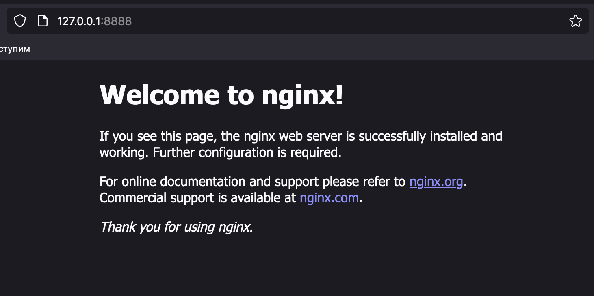
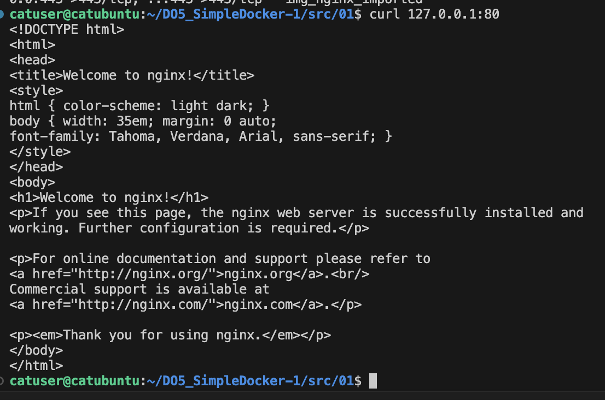
``````
Команда `docker import` используется для создания образа из архивного файла или из данных, прочитанных из стандартного ввода.

Чтобы импортировать контейнер обратно в образ, вам необходимо сначала создать архивный файл из его файловой системы. Для этого выполните следующие шаги:

1. Зайдите обратно в контейнер:
      docker start -i <container_id>

2. Создайте архив контейнера:
   В командной строке контейнера выполните:
      tar -c -C / . | gzip > container.tar.gz
   
   Эта команда создаст архив `container.tar.gz`, который содержит файловую систему контейнера.

3. Выполните импорт архива в новый образ:
      cat container.tar.gz | docker import - myimage:latest
   
   Эта команда принимает данные из архива, читаемого из стандартного ввода (с помощью `cat`), и создает новый образ с тегом `myimage:latest`.

После выполнения этих шагов появится новый образ `myimage:latest`, который содержит файловую систему вашего контейнера. Обратите внимание, что `<container_id>` и `myimage:latest` - это примеры идентификатора контейнера и тега образа; вы можете выбрать соответствующие значения для вашего случая.
``````
``````
Если у вас уже есть контейнер Nginx и вы хотите создать архив его файловой системы, вы можете использовать ту же команду, но заменив корневую директорию на расположение файлов Nginx в контейнере. Обычно файлы Nginx находятся внутри контейнера по пути `/etc/nginx/` для конфигурационных файлов и `/usr/share/nginx/` для файлов сайта.

Вот как это может выглядеть:

docker run --name temp_nginx nginx   # создаем временный контейнер nginx
docker cp temp_nginx:/etc/nginx/ ./nginx_configs    # копируем конфигурационные файлы 
docker cp temp_nginx:/usr/share/nginx/ ./nginx_files    # копируем файлы сайта
tar -czvf nginx_files.tar.gz ./nginx_configs ./nginx_files    # создаем архив с файлами


Эта последовательность команд создаст архив файлов Nginx в две отдельные директории: `nginx_configs` для конфигурационных файлов и `nginx_files` для файлов сайта. Затем архивирует эти директории в архив `nginx_files.tar.gz`.
``````

## Part 3. Мини веб-сервер

Настало время немного оторваться от докера, чтобы подготовиться к последнему этапу. Настало время написать свой сервер.

**== Задание ==**

##### Написать мини сервер на **C** и **FastCgi**, который будет возвращать простейшую страничку с надписью `Hello World!`
##### Запустить написанный мини сервер через *spawn-fcgi* на порту 8080
##### Написать свой *nginx.conf*, который будет проксировать все запросы с 81 порта на *127.0.0.1:8080*
##### Проверить, что в браузере по *localhost:81* отдается написанная вами страничка
##### Положить файл *nginx.conf* по пути *./nginx/nginx.conf* (это понадобится позже)

##### Учебный материал
``````
https://habr.com/ru/articles/154187/
``````
``````
https://rsdn.org/article/unix/sockets.xml
``````

##### ## Рис_26 ## Запускаем контейнер на nginx 
``````
sudo docker run --name nginxFcgi -p 81:81 -d nginx
``````
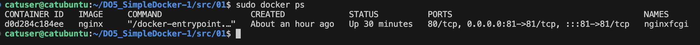

Настраиваем nginx. Копируем nginx.conf в контейнер
``````
sudo docker cp nginx.conf d0d284c184ee:/etc/nginx/
``````

##### Устанавливаем и настраиваем FastCgi
Заходим в контейнер
``````
sudo docker exec -it d0d284c184ee /bin/bash
``````
``````
Установка gcc
apt -y update
#apt -y install build-essential
apt -y install gcc

Установка FastCgi (библиотека "libfcgi-dev")
apt-get update -y
apt-get install -y libfcgi-dev spawn-fcgi
``````

Компилируем файл
``````
gcc fastcgiEasy.c -lfcgi -o nfcgi
``````

Запускаем FastCgi
``````
spawn-fcgi -p 8080 ./nfcgi
``````

##### ## Рис_27 ## Проверить запущенные процессы. Если видим как на картинке, значит FastCgi запущен
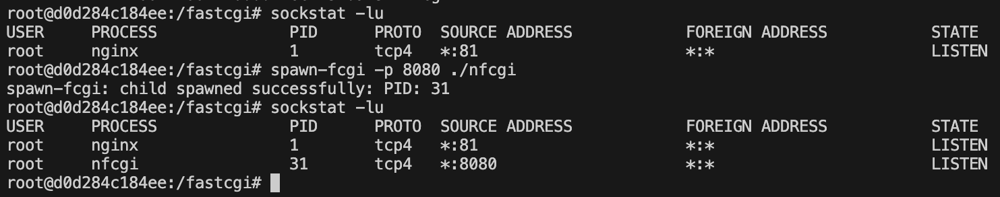

Проверить запущенные процессы
``````
sockstat -lu
``````

##### ## Рис_28 ## Делаем http запрос по порту 81 и проверяем ответ
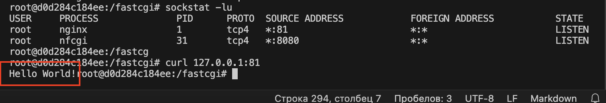

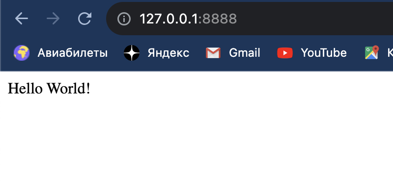


## Part 4. Свой докер

Теперь всё готово. Можно приступать к написанию докер образа для созданного сервера.

**== Задание ==**

*При написании докер образа избегайте множественных вызовов команд RUN*

#### Написать свой докер образ, который:
##### 1) собирает исходники мини сервера на FastCgi из [Части 3](#part-3-мини-веб-сервер)
##### 2) запускает его на 8080 порту
##### 3) копирует внутрь образа написанный *./nginx/nginx.conf*
##### 4) запускает **nginx**.
_**nginx** можно установить внутрь докера самостоятельно, а можно воспользоваться готовым образом с **nginx**'ом, как базовым._
##### ## Рис_29 ## Собрать написанный докер образ через `docker build` при этом указав имя и тег

``````
sudo docker build -t nginx_fcgi_server:newserv . 
``````
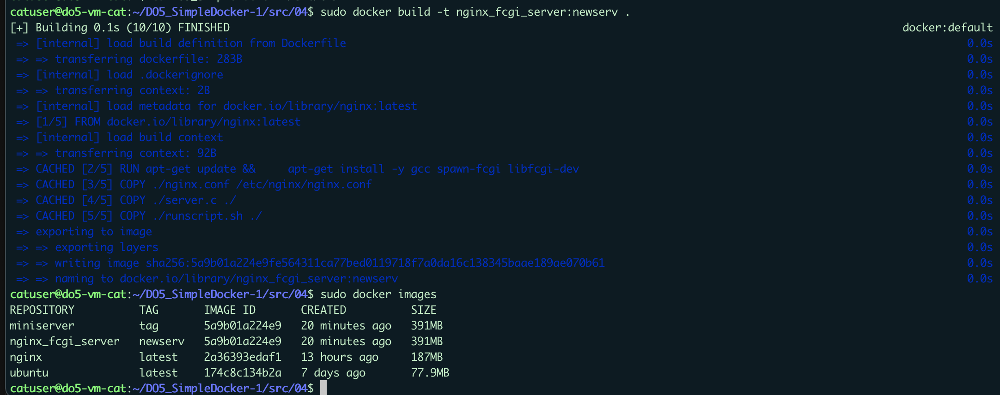

##### Проверить через `docker images`, что все собралось корректно
##### Запустить собранный докер образ с маппингом 81 порта на 80 на локальной машине и маппингом папки *./nginx* внутрь контейнера по адресу, где лежат конфигурационные файлы **nginx**'а (см. [Часть 2](#part-2-операции-с-контейнером))
##### ## Рис_30 ## Проверить, что по localhost:80 доступна страничка написанного мини сервера
``````
sudo docker run -p 80:81 -d nginx_fcgi_server:newserv . 
``````
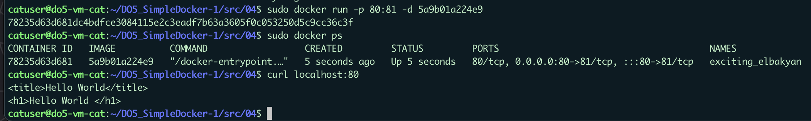

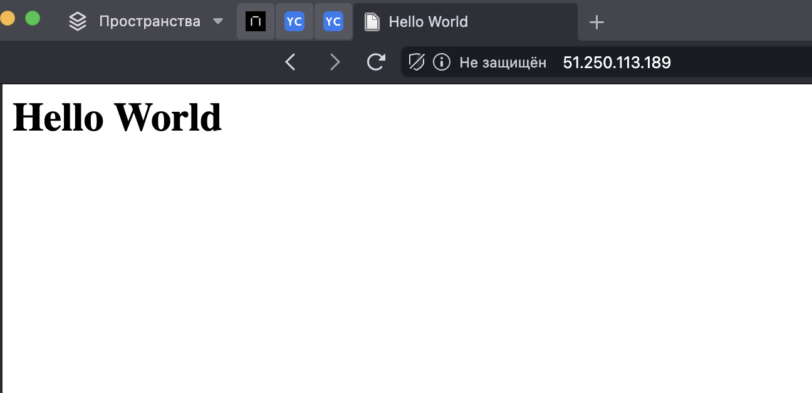

##### Дописать в *./nginx/nginx.conf* проксирование странички */status*, по которой надо отдавать статус сервера **nginx**
##### Перезапустить докер образ
##### ## Рис_31 ## Проверить, что теперь по *localhost:80/status* отдается страничка со статусом **nginx**

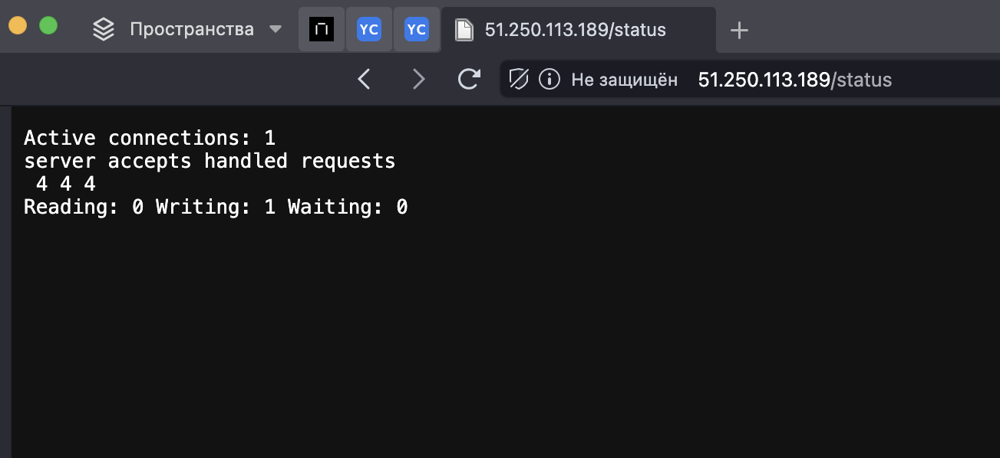

``````
Монтирование файла конфигурации Nginx из хост-системы в контейнер позволяет изменять конфигурацию Nginx без необходимости пересобирать образ контейнера. Таким образом, можно вносить изменения в конфигурацию на лету, без остановки и перезапуска контейнера. Кроме того, это позволяет использовать один и тот же файл конфигурации для нескольких контейнеров, что упрощает управление конфигурацией и обновления.
``````

## Part 5. **Dockle**

После написания образа никогда не будет лишним проверить его на безопасность.

**== Задание ==**

``````
Установка Dockle
``````

``````
VERSION=$(
 curl --silent "https://api.github.com/repos/goodwithtech/dockle/releases/latest" | \
 grep '"tag_name":' | \
 sed -E 's/.*"v([^"]+)".*/\1/' \
) && curl -L -o dockle.deb https://github.com/goodwithtech/dockle/releases/download/v${VERSION}/dockle_${VERSION}_Linux-64bit.deb
``````
```
sudo dpkg -i dockle.deb && rm dockle.deb
```

##### Просканировать образ из предыдущего задания через `dockle [image_id|repository]`

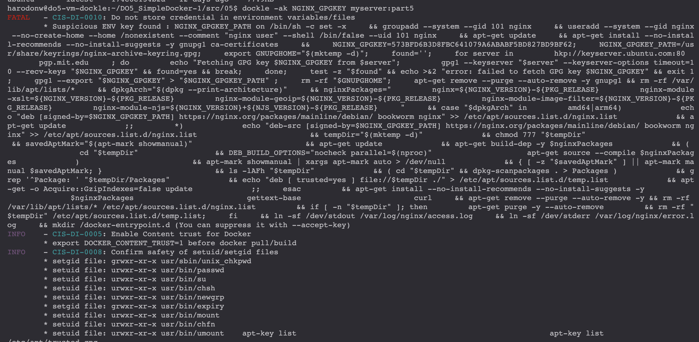

``````
FATAL - ошибка в шифровании данных и использовании авторизационных данных в переменных окружения. Проблема решается при сборки образа Dockerfile через ubuntu и затем установки nginx из проверенного репозитория с gpg  ключом. Либо воспользоваться командой dockle -i CIS-DI-0010
``````

##### Исправить образ так, чтобы при проверке через **dockle** не было ошибок и предупреждений

``````
dockle -i CIS-DI-0010 myserver:part5 
``````
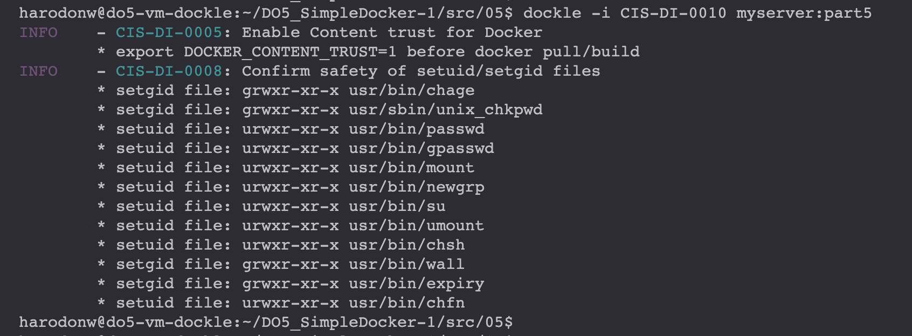


## Part 6. Базовый **Docker Compose**

Вот вы и закончили вашу разминку. А хотя погодите...
Почему бы не поэкспериментировать с развёртыванием проекта, состоящего сразу из нескольких докер образов?

**== Задание ==**

##### Написать файл *docker-compose.yml*, с помощью которого:
##### 1) Поднять докер контейнер из [Части 5](#part-5-инструмент-dockle) _(он должен работать в локальной сети, т.е. не нужно использовать инструкцию **EXPOSE** и мапить порты на локальную машину)_
##### 2) Поднять докер контейнер с **nginx**, который будет проксировать все запросы с 8080 порта на 81 порт первого контейнера
##### Замапить 8080 порт второго контейнера на 80 порт локальной машины

##### Остановить все запущенные контейнеры
##### Собрать и запустить проект с помощью команд `docker-compose build` и `docker-compose up`
##### Проверить, что в браузере по *localhost:80* отдается написанная вами страничка, как и ранее
